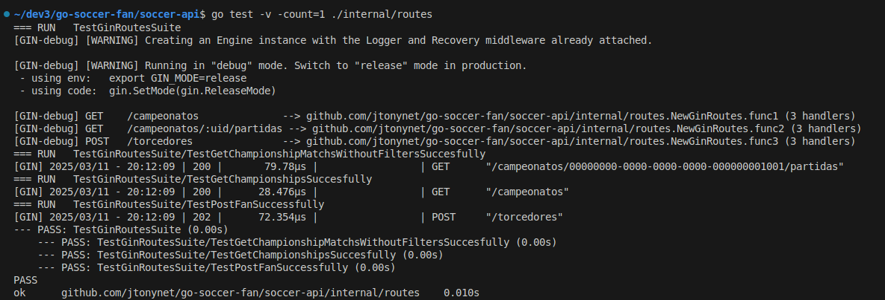
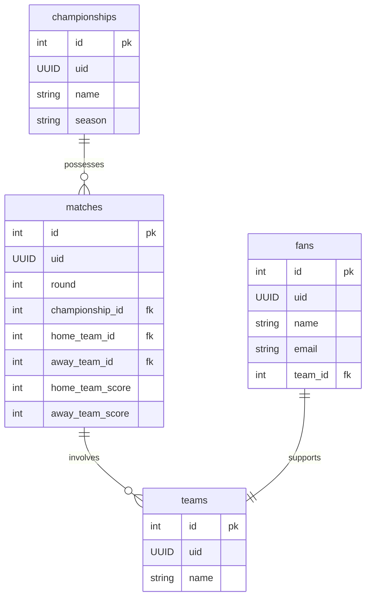
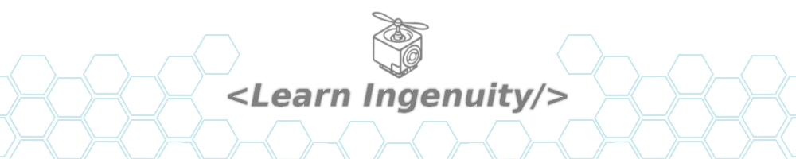

<a id="header"></a>


<center>
<a href="#header">
    
</a>
</center>

<!-- 
    icons by:
    https://devicon.dev/
    https://simpleicons.org/
-->
[](https://go.dev/) [](https://gin-gonic.com/) [](https://www.postgresql.org/)  [](https://www.docker.com/) [](https://ubuntu.com/) [](https://github.com/spf13/viper) [](https://github.com/jtonynet) [](https://code.visualstudio.com/) [](https://mermaid.js.org/) 

<!-- 
[](https://swagger.io/) [](https://docs.github.com/en/actions) 

[](https://https://miro.com/)
-->

[](#header) [](https://github.com/users/jtonynet/projects/8) <!--[](https://github.com/jtonynet/go-pique-nique/actions) --> 

[](https://go.dev/)

## 🕸️ Redes

[](https://www.linkedin.com/in/jos%C3%A9-r-99896a39/) [](mailto:learningenuity@gmail.com)

---

## 📁 O Projeto

<a id="index"></a>
### ⤴️ Índice


__[Go Soccer Fan](#header)__<br/>
  1.  ⤴️ [Índice](#index)
  2.  📖 [Sobre](#about)
  3.  💻 [Rodando o Projeto](#run)
      - 🌐 [Ambiente](#environment)
      - 🐋 [Conteinerizado](#run-containerized)
  4.  ✅ [Testes](#tests)
  5.  🧠 [ADR - Architecture Decision Records](#adr)
  6.  🔢 [Versões](#versions)
  7.  📊 [Diagramas](#diagrams)
      - 📈 [ER](#diagrams-erchart)
  8.  🤖 [Uso de IA](#ia)
  9.  🏁 [Conclusão](#conclusion)

<hr/>

<a id="about"></a>
### 📖 Sobre

**TODO**

<br/>


<br/>

[⤴️ de volta ao índice](#index)

---

<a id="run"></a>
### 💻 Rodando o Projeto

<a id="environment"></a>
#### 🌐 Ambiente

`Docker` e `Docker Compose` são necessários para rodar a aplicação de forma containerizada, e é fortemente recomendado utilizá-los para rodar o banco de dados e demais dependências localmente. Siga as instruções abaixo caso não tenha esses softwares instalados em sua máquina:

- &nbsp;&nbsp;[Instalando Docker](https://docs.docker.com/engine/install/)
- &nbsp;&nbsp;[Instalando Docker Compose](https://docs.docker.com/compose/install/)

<br/>
<div align="center">. . . . . . . . . . . . . . . . . . . . . . . . . . . .</div>
<br/>

<a id="run-containerized"></a>
#### 🐋 Containerizado 

Crie uma copia do arquivo `./soccer-api/.env.SAMPLE` e renomeie para `./soccer-api/.env`. rode o comandos `docker compose` (de acordo com sua versão do docker compose) no diretório raiz do projeto

```bash
docker compose up
```

A `REST` `API` deve responder no caminho `http://localhost:8080`

<br/>

[⤴️ de volta ao índice](#index)

---

<a id="tests"></a>
### ✅ Testes

Rodando localmente com `GO v1.23.2`

Caso não tenha as dependência instaladas, instale-as localmente na pasta da `API`:
```bash
cd soccer-api
go mod download
```

<br/>

Performe os testes na pasta da `API`:
```bash
go test -v -count=1 ./internal/routes
```

Saída esperada (rodando no terminal do VScode):
<div align="center">
    
</div>

<br/>

[⤴️ de volta ao índice](#index)

---

<a id="diagrams"></a>
### 📊 Diagramas

<a id="diagrams-erchart"></a>
#### 📈 ER

<div align="center">



</div>

<br/>

[⤴️ de volta ao índice](#index)

---

<a id="adr"></a> 
### 🧠 ADR - Architecture Decision Records

- [0001: Registro de Decisões de Arquitetura (ADR)](./docs/architecture/decisions/0001-registro-de-decisoes-de-arquitetura.md)
- [0002: Go, Gin, Gorm e PostgreSQL com Arquitetura Três Camadas e TDD](./docs/architecture/decisions/0002-go-gin-gorm-e-postgres-com-arquitetura-tres-camadas-e-tdd.md)


<br/>

[⤴️ de volta ao índice](#index)

---

<a id="versions"></a>
### 🔢 Versões

As tags de versões estão sendo criadas manualmente a medida que o projeto avança. Cada tarefa é desenvolvida em uma branch a parte (Branch Based, [feature branch](https://www.atlassian.com/git/tutorials/comparing-workflows/feature-branch-workflow)) e quando finalizadas é gerada tag e mergeadas em main.

Para obter mais informações, consulte o [Histórico de Versões](./CHANGELOG.md).

<br/>

[⤴️ de volta ao Index](#index)

---

<a id="ia"></a>
### 🤖 Uso de IA

A figura do cabeçalho nesta página foi criada com a ajuda de inteligência artificial e um mínimo de retoques e construção no Gimp [](https://www.gimp.org/)

__Os seguintes prompts foram usados para criação no  [Bing IA:](https://www.bing.com/images/create/)__

<details>
  <summary><b>Gophers Torcedores</b></summary>
"Três gophers azuis felizes e animados, simbolo da linguagem golang, como torcedores de futebol (soccer), o da frente ao meio com uma camisa listrada horizontal vermelho e preto, outro com uma camisa branca com faixa diagonal preta e outro uma camisa verde com uma unica listra horizontal verde mais clara em estilo cartoon infantil, historia em quadrinhos, fundo branco chapado para facilitar remoção"<b>(sic)</b>
</details>

<br/>

IA também é utilizada em minhas pesquisas e estudos como ferramenta de apoio; no entanto,  __artes e desenvolvimento são, acima de tudo, atividades criativas humanas. Valorize as pessoas!__

Contrate artistas para projetos comerciais ou mais elaborados e aprenda a ser engenhoso!

<br/>

[⤴️ de volta ao índice](#index)

---

<a id="conclusion"></a>
### 🏁 Conclusão

- TODO

Este desafio me permite consolidar conhecimentos e identificar pontos cegos para aprimoramento. Continuarei trabalhando para evoluir o projeto e expandir minhas habilidades.

<br/>

[⤴️ de volta ao índice](#index)

---

<a id="footer"></a>

<br/>

>  _"Lifelong Learning & Prosper"_
> <br/> 
>  _Mr. Spock, maybe_   🖖🏾🚀

<div align="center">
<a href="#footer">

</a>
</div>

<!-- 

#TEST SEEDER

INSERT INTO championships (uid, name, season, created_at, updated_at)
VALUES
    ('00000000-0000-0000-0000-000000001001', 'Campeonato Brasileiro', '2025', NOW(), NOW()),
    ('00000000-0000-0000-0000-000000001002', 'UEFA Champions League', '2025', NOW(), NOW());

INSERT INTO teams (uid, name, created_at, updated_at)
VALUES
    ('00000000-0000-0000-0000-000000002001', 'Flamengo', NOW(), NOW()),
    ('00000000-0000-0000-0000-000000002002', 'Vasco', NOW(), NOW()),
    ('00000000-0000-0000-0000-000000002003', 'Santos', NOW(), NOW()),
    ('00000000-0000-0000-0000-000000002004', 'Corinthians', NOW(), NOW());

INSERT INTO matchs (uid, round, championship_id, home_team_id, away_team_id, home_team_score, away_team_score, created_at, updated_at)
VALUES
    ('00000000-0000-0000-0000-000000003001', 1, 1, 1, 2, 2, 1, NOW(), NOW()),
    ('00000000-0000-0000-0000-000000003002', 1, 1, 3, 4, 2, 2, NOW(), NOW()),
    ('00000000-0000-0000-0000-000000003003', 2, 1, 1, 4, NULL, NULL, NOW(), NOW());

-->