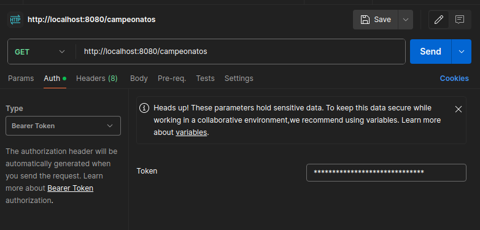
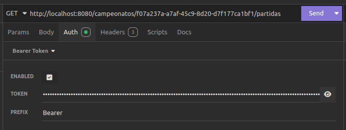
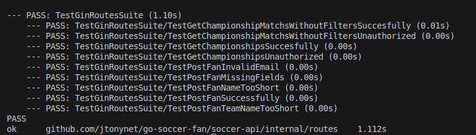
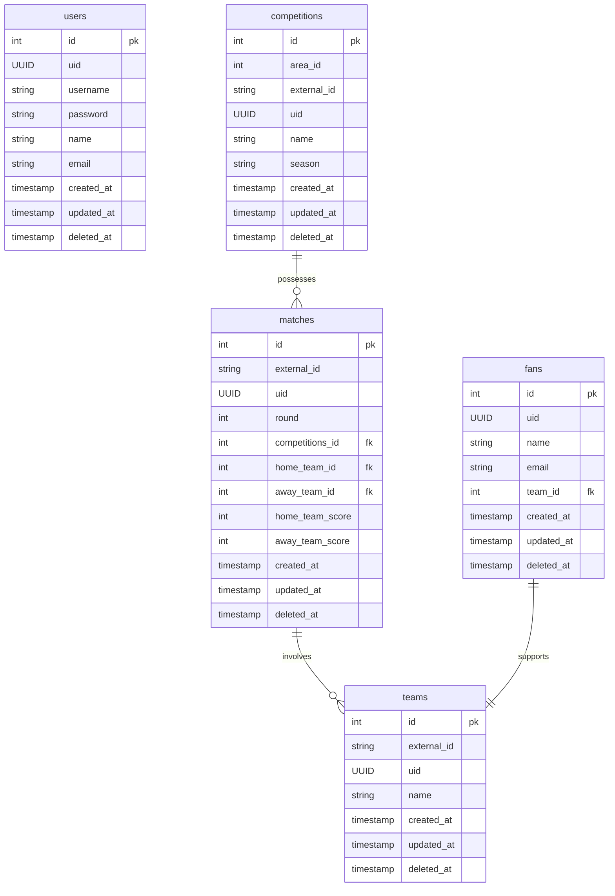

<a id="header"></a>


<center>
<a href="#header">
    
</a>
</center>

<!-- 
    icons by:
    https://devicon.dev/
    https://simpleicons.org/
-->
[](https://go.dev/) [](https://gin-gonic.com/) [](https://www.postgresql.org/)  [](https://www.docker.com/) [](https://ubuntu.com/) [](https://github.com/spf13/viper) [](https://github.com/jtonynet) [](https://code.visualstudio.com/) [](https://mermaid.js.org/) [](https://rabbitmq.com/) [](https://github.com/mailhog/MailHog)

<!-- 
[](https://swagger.io/) [](https://docs.github.com/en/actions) 

[](https://https://miro.com/)
-->

[](#header) [](https://github.com/users/jtonynet/projects/8) <!--[](https://github.com/jtonynet/go-pique-nique/actions) --> 

[](https://go.dev/)

## 🕸️ Redes

[](https://www.linkedin.com/in/jos%C3%A9-r-99896a39/) [](mailto:learningenuity@gmail.com)

---

## 📁 O Projeto

<a id="index"></a>
### ⤴️ Índice


__[Go Soccer Fan](#header)__<br/>
  1.  ⤴️ [Índice](#index)
  2.  üìñ [Sobre](#about)
  3.  💻 [Rodando o Projeto](#run)
      - üåê [Ambiente](#environment)
      - üêã [Conteinerizado](#run-containerized)
      - ‚öΩ [Importando Campeonatos](#import-data)
      - ✍️ [Endpoints e Uso](#run-use)
  4.  ‚úÖ [Testes](#tests)
  5.  üöÄ [Sistema & Deploy](#system-deploy)
  6.  🧠 [ADR - Architecture Decision Records](#adr)
  7.  🔢 [Versões](#versions)
  8.  üìä [Diagramas](#diagrams)
      - üìà [ER](#diagrams-erchart)
  9.  🤖 [Uso de IA](#ia)
  10. 🏁 [Conclusão](#conclusion)

<hr/>

<a id="about"></a>
### üìñ Sobre

Desafio para a criação de um sistema de consulta e armazenamento de torneios de futebol com seus respectivos times e partidas, consumindo dados de uma API externa com proteções contra rate limit. O sistema também deve armazenar dados de torcedores e, quando uma rota específica for acionada, disparar notificações de início e fim de partida para todos os torcedores cadastrados (podendo ser centenas ou até milhares). Seus componentes devem ser altamente escaláveis.

<br/>


<br/>

[⤴️ de volta ao índice](#index)

---

<a id="run"></a>
### 💻 Rodando o Projeto

<a id="environment"></a>
#### üåê Ambiente

`Docker` e `Docker Compose` são necessários para rodar a aplicação de forma containerizada, e é fortemente recomendado utilizá-los para rodar o banco de dados e demais dependências localmente. Siga as instruções abaixo caso não tenha esses softwares instalados em sua máquina:

- &nbsp;&nbsp;[Instalando Docker](https://docs.docker.com/engine/install/)
- &nbsp;&nbsp;[Instalando Docker Compose](https://docs.docker.com/compose/install/)

<br/>
<div align="center">. . . . . . . . . . . . . . . . . . . . . . . . . . . .</div>
<br/>

<a id="run-containerized"></a>
#### üêã Containerizado 

Crie uma copia do arquivo `./soccer-api/.env.SAMPLE` e renomeie para `./soccer-api/.env`. Altere o valor da chave `EXTERNAL_API_TOKEN` no arquivo para o `X-Auth-Token` informado no documento de requisitos.

```bash
EXTERNAL_API_TOKEN=ASK-TO-DEV-TEAM
```

A seguir, rode o comandos `docker compose` (de acordo com sua versão do docker compose) no diretório raiz do projeto

```bash
docker compose up
```

Aguarde até que `api-rest` esteja funcional, exibindo uma mensagem semelhante à seguinte em seu terminal (as dependências podem demorar um pouco devido à instalação inicial):
```bash
api-rest-1 | 2025/03/17 19:17:38 stdout: [GIN-debug] Listening and serving HTTP on :8080
```

A `REST` `API` deve responder no caminho `http://localhost:8080/campeonatos`

<br/>
<div align="center">. . . . . . . . . . . . . . . . . . . . . . . . . . . .</div>
<br/>

<a id="import-data"></a>
#### ‚öΩ Importando Campeonatos

Assim que iniciada, a database da `API` não possui dados de campeonatos. A importação dessas informações é realizada por meio de um `CLI` que obtém os dados da `API` externa. Para isso, com o projeto rodando, execute o seguinte comando:

```bash
docker exec -ti soccer-api-cli /usr/src/app/bin/cli/main import competitions
```

Saída esperada (rodando no terminal do VScode):
<div align="center">
    
</div>

Isso facilita o uso de `CronJob`, `RunDeck` ou outros serviços de tarefas agendadas para que os dados sejam atualizados periodicamente.

<br/>
<div align="center">. . . . . . . . . . . . . . . . . . . . . . . . . . . .</div>
<br/>

<a id="run-use"></a>
#### ✍️ Endpoints e Uso

Uma vez importados os campeonatos e com o projeto em execução, os endpoints e ações vinculados a seguir estarão disponíveis. Esses endpoints podem ser _validados_ via [`Postman`](https://www.postman.com/), [`Insomnia`](https://insomnia.rest/) ou quaisquer clientes `REST` `HTTP`.

- Legenda:
    - 🟢 Rotas que podem ser acessadas sem autenticação
    - 🔴 Rotas que exigem autenticação

Deve-se informar como `Authorization` `Baerer` o valor do `token` informado apos consulta rota `/auth/login` nas requisições das 🔴 Rotas que exigem autenticação. 

<br/>

1. 🟢 `POST` `http://localhost:8080/user`
    - Cria um usuário administrativo (rota aberta por simplicidade. Em um sistema real, essa rota deve ser protegida e/ou interna, não sendo exposta ao público em geral ou acessível diretamente).
     - `Request body:`
        > ```json
        > {
        > 	"usuario": "admin",
        > 	"senha": "admin",
        > 	"nome": "Edson Arantes do Nascimento",
        > 	"email": "pele@soccerfan.com"
        > }
        > ```
     - `Response body:`
        > ```json
        > {
        >     "id": "7de7a50e-df58-467c-8f9e-f7f5498d37ad",
        >     "usuario": "admin",
        >     "nome": "Edson Arantes do Nascimento",
        >     "email": "pele@soccerfan.com"
        > }
        > ```


<br/>

2. 🟢 `POST` `http://localhost:8080/auth/login`
     - Autentica um usuário administrativo (rota aberta por simplicidade. Em um sistema real, essa rota deve ser protegida e/ou interna, não sendo exposta ao público em geral ou acessível diretamente).
     - `Request body:`
        > ```json
        > {
        >   "usuario": "admin",
        >   "senha": "admin"
        > }
        > ```
     - `Response body:`
        > ```json
        >{
        >   "token": "eyJhbGciOiJIUzI1NiIsInR5cCI6IkpXVCJ9..."
        >}
        > ```
     - Configurando `Baerer` no `Postman`:
      - <div align="center"></div>
     - Configurando `Baerer` no `Insominia`:
      - <div align="center"></div>

<br/>

3. 🔴`GET` `http://localhost:8080/campeonatos`
   - Lista Campeonatos disponíveis
   - `Response body:`
        > ```json
        > {
        >   "campeonatos": [
        >     {
        >       "id": "ff8180b9-b039-4019-a107-b049271a58d5",
        >       "nome": "Campeonato Brasileiro Série A",
        >       "temporada": "2025"
        >     },
        >     {
        >       "id": "194fcf9e-d373-4da6-bf66-96f5de4ae87b",
        >       "nome": "Championship",
        >       "temporada": "2025"
        >     }
        >   ]
        > }
        > ```

<br/>

4. 🔴`GET` `http://localhost:8080/campeonatos/{ID_CAMPEONATO}/partidas`
   - Lista Partidas disponíveis por rodada de um campeonato, onde `{ID_CAMPEONATO}` é um id de campeonato da listagem do `endpoint` anterior
   - `Response body:`
        > ```json
        > {
        >   "rodadas": [
        >     {
        >       "rodada": 13,
        >       "partidas": [
        >         {
        >           "time_casa": "Flamengo",
        >           "time_fora": "S√£o Paulo",
        >           "placar": "-"
        >         }
        >       ]
        >     }
        >   ]
        > }
        > ```

<br/>

5. 🟢`POST` `http://localhost:8080/torcedores`
   - Cria um torcedor vinculado a um time onde o campo `time` do `request body` deve ser obrigatoriamente igual ao nome de qualquer time que participe de algum campeonato
    - `Request body:`
       > ```json
       > {
       >   "nome": "Jonh Doe",
       >   "email": "jonhdoe@example.com",
       >   "time": "Flamengo"
       > }
       > ```
    - `Response body:`
       > ```json
       > {
       >     "id": "94383573-f0d5-4aa5-9e98-75de547ef39e",
       >     "nome": "Jonh Doe",
       >     "email": "jonhdoe@example.com",
       >     "time": "Flamengo",
       >     "mensagem": "Cadastro realizado com sucesso"
       > }
       > ```

<br/>

6. 🔴`POST` `http://localhost:8080/broadcast`
   - Faz `broadcast` para todos os `torcedores` do time informado no campo `time` do `request body`, enviando a `mensagem` informada tendo por título o valor do campo `tipo`. Essas mensagens hoje são enviadas exclusivamente por email (campo que possuímos no cadastro) podendo ser estendidas a outros tipos de notificações no futuro
   - `Request body:`
        > ```json
        > {
        >  "tipo": "fim",
        >  "time": "Flamengo",
        >  "placar": "7-1",
        >  "mensagem": "O jogo terminou com placar 7-1"
        > }
        > ```
        >
        > `ALTERNATIVAMENTE`
        >
       > ```json
        > {
        >  "tipo": "inicio",
        >  "time": "Flamengo",
        >  "mensagem": "O jogo iniciou"
        > }
        > ```
   - `Response body:`
        > ```json
        > {
        >     "mensagem": "Notificação enviada"
        > }
        > ```

<br/>

7. O `client` do `Mailhog` pode ser acessado na url: [http://localhost:8025/](http://localhost:8025/). Ele captura os emails enviados aos torcedores da aplicação, validando o adequado funcionamento do `broadcast`.
   - Tela do `Mailhog`
      - <div align="center"></div>
      -  Caso os emails não apareçam  imediatamente após o endpoint de `broadcast` ter respondido com `status-code` `202` e com ` "mensagem": "Notificação enviada"` clique no botao de refresh `🔄` do `Mailhog`

<br/>

8. O `client` do `RabbitMQ` pode ser acessado na url: [http://localhost:15672/](http://localhost:15672/) (user: admin, senha: admin). Ele possui duas filas disponiveis para a aplicação
   - `MATCH_NOTIFICATIONS` 
     - Produtor: `api-rest` - Produz UMA notificação de `broadcast` (a mesma do `request body` do endpoint `http://localhost:8080/broadcast`)
     - Consumidor: `matchworker` - Consome a notificação do time e produz uma mensagem para cada torcedor para `FAN_NOTIFICATIONS`
   - `FAN_NOTIFICATIONS` 
     - Produtor: `matchworker` - Explicado anteriormente como `Consumidor` do item anterior
     - Consumidor: `fanworker` - Consome a notificação dos torcedores e para cada uma faz o envio de um `email` com o campo `mensagam` do `request body` do endpoint `broadcast`
    - Dessa maneira a `api-rest` delega responsabilidade de envio para uma arquitetura resiliente que pode ser facilmente escalada e as mensagens n√£o enviadas podem cair em uma `Dead Letter Queue` para auditorias
      - <div align="center"></div>

<br/>

[⤴️ de volta ao índice](#index)

---

<a id="tests"></a>
### ‚úÖ Testes

Evitando conflitos no desenvolvimento, uma vez que estamos desenvolvendo com `dockerizado` com `live reload` (o `Dockerfile` foi criado visando exclusivamente desenvolvimento e validação.), com as dependencias sendo executadas use o seguinte comando:
```bash
docker exec -ti soccer-api-rest-1 go test -v -count=1 ./internal/routes
```

Você terá uma saída semelhante à seguinte: (executando no terminal do VS Code):
<div align="center">
    
</div>

<br/>

[⤴️ de volta ao índice](#index)

---

<a id="system-deploy"></a>
### üöÄ Sistema & Deploy

`Golang` permite a criação de múltiplos binários com pontos de entrada distintos que podem ser `deployados` em `pipelines` individuais, gerando seus respectivos `artefatos`, enquanto compartilham partes cruciais da `codebase`. Aproveitando essa funcionalidade, o sistema está dividido da seguinte maneira:

- `CLI`: Responsável pela importação de competições, times e jogos. Este componente não precisa escalar, pois pode ser executado via cron job ou manualmente, sem alta demanda de concorrência.

- `REST`: Gerencia dados de torcedores, competições e partidas. Este componente deve escalar para lidar com o tráfego de usuários que acessam e manipulam dados.

- `matchworker`: Processa eventos de partidas e "explode" essas mensagens para torcedores interessados. Este componente deve escalar horizontalmente. Essa escalabilidade pode ser simulada localmente alterando o campo `replicas` da `service` no `docker-compose.yml`
    >```yml
    >  api-match-worker:
    >    deploy:
    >      replicas: 1
    >```

- `fanworker`: Responsável por enviar notificações para torcedores. Este componente também deve escalar horizontalmente devido ao potencial alto volume de notificações. Precisa processar eventos de partidas em tempo real para milhões de torcedores, especialmente em casos de grandes torcidas. Essa escalabilidade pode ser simulada localmente alterando o campo `replicas` da `service` no `docker-compose.yml`
    >```yml
    >  api-fan-worker:
    >    deploy:
    >      replicas: 2
    >```

Podemos configurar uma pipeline de `CI/CD` usando `GitHub Actions` para automatizar o build e push das imagens `Docker` para um `Docker registry`.

Nessa esteira, ao ser validado cada componente, eles seriam deployados para seus respectivos conjuntos de `Pods`, respeitando suas necessidades de escala.

<br/>

[⤴️ de volta ao índice](#index)

---

<a id="diagrams"></a>
### üìä Diagramas

<a id="diagrams-erchart"></a>
#### üìà ER

<div align="center">


```mermaid
erDiagram

    users {
        int id pk
	    UUID uid      
	    string username 
	    string password 
	    string name     
	    string email
        timestamp created_at
        timestamp updated_at
        timestamp deleted_at   
    }


    competitions {
        int id pk
        int area_id
        string external_id
        UUID uid
        string name
        string season
        timestamp created_at
        timestamp updated_at
        timestamp deleted_at
    }
    
    matches {
        int id pk
        string external_id
        UUID uid
        int round
        int competitions_id fk
        int home_team_id fk
        int away_team_id fk
        int home_team_score
        int away_team_score
        timestamp created_at
        timestamp updated_at
        timestamp deleted_at
    }

    teams {
        int id pk
        string external_id
        UUID uid
        string name
        timestamp created_at
        timestamp updated_at
        timestamp deleted_at
    }

    fans {
        int id pk
        UUID uid
        string name
        string email
        int team_id fk
        timestamp created_at
        timestamp updated_at
        timestamp deleted_at
    }

    competitions ||--o{ matches : possesses
    matches ||--o{ teams : involves
    fans ||--|| teams : supports
```

</div>

<br/>

[⤴️ de volta ao índice](#index)

---

<a id="adr"></a> 
### 🧠 ADR - Architecture Decision Records

- [0001: Registro de Decisões de Arquitetura (ADR)](./docs/architecture/decisions/0001-registro-de-decisoes-de-arquitetura.md)
- [0002: Go, Gin, Gorm e PostgreSQL com Arquitetura Três Camadas e TDD](./docs/architecture/decisions/0002-go-gin-gorm-e-postgres-com-arquitetura-tres-camadas-e-tdd.md)


<br/>

[⤴️ de volta ao índice](#index)

---

<a id="versions"></a>
### 🔢 Versões

As tags de versões estão sendo criadas manualmente a medida que o projeto avança. Cada tarefa é desenvolvida em uma branch a parte (Branch Based, [feature branch](https://www.atlassian.com/git/tutorials/comparing-workflows/feature-branch-workflow)) e quando finalizadas é gerada tag e mergeadas em main.

Para obter mais informações, consulte o [Histórico de Versões](./CHANGELOG.md).

<br/>

[⤴️ de volta ao Index](#index)

---

<a id="ia"></a>
### 🤖 Uso de IA

A figura do cabeçalho nesta página foi criada com a ajuda de inteligência artificial e um mínimo de retoques e construção no Gimp [](https://www.gimp.org/)

__Os seguintes prompts foram usados para criação no  [Bing IA:](https://www.bing.com/images/create/)__

<details>
  <summary><b>Gophers Torcedores</b></summary>
"Três gophers azuis felizes e animados, simbolo da linguagem golang, como torcedores de futebol (soccer), o da frente ao meio com uma camisa listrada horizontal vermelho e preto, outro com uma camisa branca com faixa diagonal preta e outro uma camisa verde com uma unica listra horizontal verde mais clara em estilo cartoon infantil, historia em quadrinhos, fundo branco chapado para facilitar remoção"<b>(sic)</b>
</details>

<br/>

IA também é utilizada em minhas pesquisas e estudos como ferramenta de apoio; no entanto,  __artes e desenvolvimento são, acima de tudo, atividades criativas humanas. Valorize as pessoas!__

Contrate artistas para projetos comerciais ou mais elaborados e aprenda a ser engenhoso!

<br/>

[⤴️ de volta ao índice](#index)

---

<a id="conclusion"></a>
### 🏁 Conclusão

Os principais requisitos foram atendidos, mas existem pontos de melhoria evidentes que devem ser priorizados em projetos continuados.

- Pontos de Melhoria
    - Filtros opcionais
    - Aumento da cobertura de teste se faz necess√°rio
    - Formatar mensagens de erro do validador
    - Adotar um `Identity Manager`  mais robusto como `Keycloack` para geranciamento de `roles` (torcedor, usu√°rio admin)
    - Esteira de `CI` com `GithubActions` para garantir mesclagens seguras
    - Documentação Swagger

<br/>

- Desej√°veis
    - Arquitetar maneira de automatizar os envios de `broadcast`, em vez de depender do acesso a um endpoint específico.
    - Teste de performance com `Gatling` ou `K6` para validar o fluxo de envio de notificações
    - Pela proposta do envio em massa que conta com dois `workers` para garantir a escalabilidade, um bom acrescimo ao projeto seria `Observabilidade`. `Prometheus`, `Grafana` e `Loki` seriam bem vindos.

<br/>

Este desafio me permite consolidar conhecimentos e identificar pontos cegos para aprimoramento. Continuarei trabalhando para evoluir o projeto e expandir minhas habilidades.

<br/>

[⤴️ de volta ao índice](#index)

---

<a id="footer"></a>

<br/>

>  _"Lifelong Learning & Prosper"_
> <br/> 
>  _Mr. Spock, maybe_   üññüèæüöÄ

<div align="center">
<a href="#footer">

</a>
</div>

<!-- 

docker stop $(docker ps -aq)
docker rm $(docker ps -aq)
docker rmi $(docker images -q) --force
docker volume rm $(docker volume ls -q) --force
docker network prune -f
docker system prune -a --volumes

sudo systemctl restart docker

#TEST SEEDER

INSERT INTO competitions (uid, name, season, created_at, updated_at)
VALUES
    ('00000000-0000-0000-0000-000000001001', 'Campeonato Brasileiro', '2025', NOW(), NOW()),
    ('00000000-0000-0000-0000-000000001002', 'UEFA Champions League', '2025', NOW(), NOW());

INSERT INTO teams (uid, name, created_at, updated_at)
VALUES
    ('00000000-0000-0000-0000-000000002001', 'Flamengo', NOW(), NOW()),
    ('00000000-0000-0000-0000-000000002002', 'Vasco', NOW(), NOW()),
    ('00000000-0000-0000-0000-000000002003', 'Santos', NOW(), NOW()),
    ('00000000-0000-0000-0000-000000002004', 'Corinthians', NOW(), NOW());

INSERT INTO matches (uid, round, competition_id, home_team_id, away_team_id, home_team_score, away_team_score, created_at, updated_at)
VALUES
    ('00000000-0000-0000-0000-000000003001', 1, 1, 1, 2, 2, 1, NOW(), NOW()),
    ('00000000-0000-0000-0000-000000003002', 1, 1, 3, 4, 2, 2, NOW(), NOW()),
    ('00000000-0000-0000-0000-000000003003', 2, 1, 1, 4, NULL, NULL, NOW(), NOW());


TRUNCATE TABLE public.competitions RESTART IDENTITY CASCADE;
TRUNCATE TABLE public.teams RESTART IDENTITY CASCADE;
TRUNCATE TABLE public.fans RESTART IDENTITY CASCADE;
TRUNCATE TABLE public.matches RESTART IDENTITY CASCADE;

ALTER SEQUENCE public.competitions_id_seq RESTART WITH 1;
ALTER SEQUENCE public.fans_id_seq RESTART WITH 1;
ALTER SEQUENCE public.matches_id_seq RESTART WITH 1;
ALTER SEQUENCE public.teams_id_seq RESTART WITH 1;

mailhog: http://localhost:8025/
rabbitMQ: http://localhost:15672/ - admin-admin

-->
