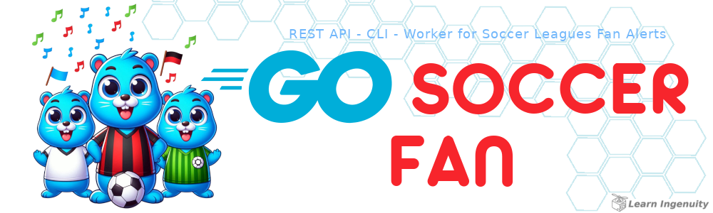

<a id="header"></a>


<center>
<a href="#header">
    
</a>
</center>

<!-- 
    icons by:
    https://devicon.dev/
    https://simpleicons.org/
-->
[](https://go.dev/) [](https://gin-gonic.com/) [](https://www.postgresql.org/)  [](https://www.docker.com/) [](https://ubuntu.com/) [](https://github.com/spf13/viper) [](https://github.com/jtonynet) [](https://code.visualstudio.com/) [](https://mermaid.js.org/) [](https://rabbitmq.com/) [](https://github.com/mailhog/MailHog)

<!-- 
[](https://swagger.io/) [](https://docs.github.com/en/actions) 

[](https://https://miro.com/)
-->

[](#header) [](https://github.com/users/jtonynet/projects/8) <!--[](https://github.com/jtonynet/go-pique-nique/actions) --> 

[](https://go.dev/)

## 🕸️ Redes

[](https://www.linkedin.com/in/jos%C3%A9-r-99896a39/) [](mailto:learningenuity@gmail.com)

---

## 📁 O Projeto

<a id="index"></a>
### ⤴️ Índice


__[Go Soccer Fan](#header)__<br/>
  1.  ⤴️ [Índice](#index)
  2.  📖 [Sobre](#about)
  3.  💻 [Rodando o Projeto](#run)
      - 🌐 [Ambiente](#environment)
      - 🐋 [Conteinerizado](#run-containerized)
      - ⚽ [Importando Campeonatos](#import-data)
      - ✍️ [Endpoints e Uso](#run-use)
  4.  ✅ [Testes](#tests)
  5.  🧠 [ADR - Architecture Decision Records](#adr)
  6.  🔢 [Versões](#versions)
  7.  📊 [Diagramas](#diagrams)
      - 📈 [ER](#diagrams-erchart)
  8.  🤖 [Uso de IA](#ia)
  9.  🏁 [Conclusão](#conclusion)

<hr/>

<a id="about"></a>
### 📖 Sobre

**TODO**

<br/>


<br/>

[⤴️ de volta ao índice](#index)

---

<a id="run"></a>
### 💻 Rodando o Projeto

<a id="environment"></a>
#### 🌐 Ambiente

`Docker` e `Docker Compose` são necessários para rodar a aplicação de forma containerizada, e é fortemente recomendado utilizá-los para rodar o banco de dados e demais dependências localmente. Siga as instruções abaixo caso não tenha esses softwares instalados em sua máquina:

- &nbsp;&nbsp;[Instalando Docker](https://docs.docker.com/engine/install/)
- &nbsp;&nbsp;[Instalando Docker Compose](https://docs.docker.com/compose/install/)

<br/>
<div align="center">. . . . . . . . . . . . . . . . . . . . . . . . . . . .</div>
<br/>

<a id="run-containerized"></a>
#### 🐋 Containerizado 

Crie uma copia do arquivo `./soccer-api/.env.SAMPLE` e renomeie para `./soccer-api/.env`. Altere o valor da chave `EXTERNAL_API_TOKEN` no arquivo para o `X-Auth-Token` informado no documento de requisitos.

```bash
EXTERNAL_API_TOKEN=ASK-TO-DEV-TEAM
```

A seguir, rode o comandos `docker compose` (de acordo com sua versão do docker compose) no diretório raiz do projeto

```bash
docker compose up
```

Aguarde até que `api-rest` esteja funcional, exibindo uma mensagem semelhante à seguinte em seu terminal (as dependências podem demorar um pouco devido à instalação inicial):
```bash
api-rest-1 | 2025/03/17 19:17:38 stdout: [GIN-debug] Listening and serving HTTP on :8080
```

A `REST` `API` deve responder no caminho `http://localhost:8080`

<br/>
<div align="center">. . . . . . . . . . . . . . . . . . . . . . . . . . . .</div>
<br/>

<a id="import-data"></a>
#### ⚽ Importando Campeonatos

Assim que iniciada, a database da `API` não possui dados de campeonatos. A importação dessas informações é realizada por meio de um `CLI` que obtém os dados da `API` externa. Para isso, com o projeto rodando, execute o seguinte comando:

```bash
docker exec -ti soccer-api-cli /usr/src/app/bin/cli/main import competitions
```

Saída esperada (rodando no terminal do VScode):
<div align="center">
    
</div>

Isso facilita o uso de `CronJob`, `RunDeck` ou outros serviços de tarefas agendadas para que os dados sejam atualizados periodicamente.

<br/>
<div align="center">. . . . . . . . . . . . . . . . . . . . . . . . . . . .</div>
<br/>

<a id="run-use"></a>
#### ✍️ Endpoints e Uso

Uma vez importados os campeonatos e com o projeto em execução, os endpoints e ações vinculados a seguir estarão disponíveis. Esses endpoints podem ser _validados_ via [`Postman`](https://www.postman.com/), [`Insomnia`](https://insomnia.rest/) ou quaisquer clientes `REST` `HTTP`.

- Legenda:
    - 🟢 Rotas que podem ser acessadas sem autenticação
    - 🔴 Rotas que exigem autenticação

Deve-se informar como `Authozition` `Baerer-Token` o valor do `token` informado apos consulta rota `/auth/login` nas requisições das 🔴 Rotas que exigem autenticação. 

<br/>

1. 🟢 `POST` `http://localhost:8080/user`
    - Cria um usuário administrativo (rota aberta por simplicidade. Em um sistema real, essa rota deve ser protegida e interna, não sendo exposta ao público em geral ou acessível diretamente).
     - `Request body:`
        > ```json
        > {
        > 	"usuario": "admin",
        > 	"senha": "admin",
        > 	"nome": "Edson Arantes do Nascimento",
        > 	"email": "pele@soccerfan.com"
        > }
        > ```
     - `Response body:`
        > ```json
        > {
        >     "id": "7de7a50e-df58-467c-8f9e-f7f5498d37ad",
        >     "usuario": "admin",
        >     "nome": "Edson Arantes do Nascimento",
        >     "email": "pele@soccerfan.com"
        > }
        > ```


<br/>

2. 🟢 `POST` `http://localhost:8080/auth/login`
     - Autentica um usuário administrativo (rota aberta por simplicidade. Em um sistema real, essa rota deve ser protegida e interna, não sendo exposta ao público em geral ou acessível diretamente).
     - `Request body:`
        > ```json
        > {
        >   "usuario": "admin",
        >   "senha": "admin"
        > }
        > ```
     - `Response body:`
        > ```json
        >{
        >   "token": "eyJhbGciOiJIUzI1NiIsInR5cCI6IkpXVCJ9..."
        >}
        > ```

<br/>

3. 🔴`GET` `http://localhost:8080/campeonatos`
   - Lista Campeonatos disponíveis
   - `Response body:`
        > ```json
        > {
        >   "campeonatos": [
        >     {
        >       "id": "ff8180b9-b039-4019-a107-b049271a58d5",
        >       "nome": "Campeonato Brasileiro Série A",
        >       "temporada": "2025"
        >     },
        >     {
        >       "id": "194fcf9e-d373-4da6-bf66-96f5de4ae87b",
        >       "nome": "Championship",
        >       "temporada": "2025"
        >     }
        >   ]
        > }
        > ```

<br/>

4. 🔴`GET` `http://localhost:8080/campeonatos/{ID_CAMPEONATO}/partidas`
   - Lista Partidas disponíveis por rodada de um campeonato onde `{ID_CAMPEONATO}` é um id de campeonato da listagem do `endpoint` anterior
   - `Response body:`
        > ```json
        > {
        >   "rodadas": [
        >     {
        >       "rodada": 13,
        >       "partidas": [
        >         {
        >           "time_casa": "Flamengo",
        >           "time_fora": "São Paulo",
        >           "placar": "-"
        >         }
        >       ]
        >     }
        >   ]
        > }
        > ```

<br/>

5. 🟢`POST` `http://localhost:8080/torcedores`
   - Cria um torcedor vinculado a um Time onde o campo `time` do `request body` deve ser obrigatoriamente igual ao nome de qualquer time que participe de algum campeonato
    - `Request body:`
       > ```json
       > {
       >   "nome": "Jonh Doe",
       >   "email": "jonhdoe@example.com",
       >   "time": "Flamengo"
       > }
       > ```
    - `Response body:`
       > ```json
       > {
       >     "id": "94383573-f0d5-4aa5-9e98-75de547ef39e",
       >     "nome": "Jonh Doe",
       >     "email": "jonhdoe@example.com",
       >     "time": "Flamengo",
       >     "mensagem": "Cadastro realizado com sucesso"
       > }
       > ```

<br/>

6. 🔴`POST` `http://localhost:8080/broadcast`
   - Faz `broadcast` para todos os `torcedores` do time informado no campo `time` do `request body`, enviando a `mensagem` informada tendo por título a ação do campo `tipo`. Essas mensagens hoje são enviadas exclusivamente por email (campo que possuímos no cadastro) podendo ser estendidas a outros tipos de notificações no futuro
   - `Request body:`
        > ```json
        > {
        >  "tipo": "fim",
        >  "time": "Flamengo",
        >  "placar": "7-1",
        >  "mensagem": "O jogo terminou com placar 7-1"
        > }
        > ```
   - `Response body:`
        > ```json
        > {
        >     "mensagem": "Notificação enviada"
        > }
        > ```

<br/>

7. O `client` do `Mailhog` pode ser acessado na url: [http://localhost:8025/](http://localhost:8025/). Ele captura os emails enviados aos torcedores da aplicação, validando o adequado funcionamento do `broadcast`.
   - Tela do `Mailhog`
      - 
      -  Caso os emails não apareçam  imediatamente após o endpoint de `broadcast` ter respondido com `status-code` `202` e com ` "mensagem": "Notificação enviada"` clique no botao de refresh `🔄` do `Mailhog`

<br/>

8. O `client` do `RabbitMQ` pode ser acessado na url: [http://localhost:15672/](http://localhost:15672/) (user: admin, senha: admin). Ele possui duas filas disponiveis para a aplicação
   - `MATCH_NOTIFICATIONS` 
     - Produtor: `api-rest` - Produz UMA notificação de `broadcast` (a mesma do `request body` do endpoint `http://localhost:8080/broadcast`)
     - Consumidor: `matchworker` - Consome a notificação do time e produz uma mensagem para cada torcedor para `FAN_NOTIFICATIONS`
   - `FAN_NOTIFICATIONS` 
     - Produtor: `matchworker` - Explicado anteriormente como `Consumidor` do item anterior
     - Consumidor: `fanworker` - Consome a notificação dos torcedores e para cada uma faz o envio de um `email` com o campo `mensagam` do `request body` do endpoint `broadcast`
    - Dessa maneira a `api-rest` delega responsabilidade de envio para uma arquitetura resiliente que pode ser facilmente escalada e as mensagens não enviadas podem cair em uma `Dead Letter Queue` para auditorias
      - 

<br/>

[⤴️ de volta ao índice](#index)

---

<a id="tests"></a>
### ✅ Testes

Rodando localmente com `GO v1.23.2`

Caso não tenha as dependência instaladas, instale-as localmente na pasta da `API`:
```bash
cd soccer-api
go mod download
```

<br/>

Performe os testes na pasta da `API`:
```bash
go test -v -count=1 ./internal/routes
```

Saída esperada (rodando no terminal do VScode):
<div align="center">
    
</div>

<br/>

[⤴️ de volta ao índice](#index)

---

<a id="diagrams"></a>
### 📊 Diagramas

<a id="diagrams-erchart"></a>
#### 📈 ER

<div align="center">


</div>

<br/>

[⤴️ de volta ao índice](#index)

---

<a id="adr"></a> 
### 🧠 ADR - Architecture Decision Records

- [0001: Registro de Decisões de Arquitetura (ADR)](./docs/architecture/decisions/0001-registro-de-decisoes-de-arquitetura.md)
- [0002: Go, Gin, Gorm e PostgreSQL com Arquitetura Três Camadas e TDD](./docs/architecture/decisions/0002-go-gin-gorm-e-postgres-com-arquitetura-tres-camadas-e-tdd.md)


<br/>

[⤴️ de volta ao índice](#index)

---

<a id="versions"></a>
### 🔢 Versões

As tags de versões estão sendo criadas manualmente a medida que o projeto avança. Cada tarefa é desenvolvida em uma branch a parte (Branch Based, [feature branch](https://www.atlassian.com/git/tutorials/comparing-workflows/feature-branch-workflow)) e quando finalizadas é gerada tag e mergeadas em main.

Para obter mais informações, consulte o [Histórico de Versões](./CHANGELOG.md).

<br/>

[⤴️ de volta ao Index](#index)

---

<a id="ia"></a>
### 🤖 Uso de IA

A figura do cabeçalho nesta página foi criada com a ajuda de inteligência artificial e um mínimo de retoques e construção no Gimp [](https://www.gimp.org/)

__Os seguintes prompts foram usados para criação no  [Bing IA:](https://www.bing.com/images/create/)__

<details>
  <summary><b>Gophers Torcedores</b></summary>
"Três gophers azuis felizes e animados, simbolo da linguagem golang, como torcedores de futebol (soccer), o da frente ao meio com uma camisa listrada horizontal vermelho e preto, outro com uma camisa branca com faixa diagonal preta e outro uma camisa verde com uma unica listra horizontal verde mais clara em estilo cartoon infantil, historia em quadrinhos, fundo branco chapado para facilitar remoção"<b>(sic)</b>
</details>

<br/>

IA também é utilizada em minhas pesquisas e estudos como ferramenta de apoio; no entanto,  __artes e desenvolvimento são, acima de tudo, atividades criativas humanas. Valorize as pessoas!__

Contrate artistas para projetos comerciais ou mais elaborados e aprenda a ser engenhoso!

<br/>

[⤴️ de volta ao índice](#index)

---

<a id="conclusion"></a>
### 🏁 Conclusão

- TODO

Este desafio me permite consolidar conhecimentos e identificar pontos cegos para aprimoramento. Continuarei trabalhando para evoluir o projeto e expandir minhas habilidades.

<br/>

[⤴️ de volta ao índice](#index)

---

<a id="footer"></a>

<br/>

>  _"Lifelong Learning & Prosper"_
> <br/> 
>  _Mr. Spock, maybe_   🖖🏾🚀

<div align="center">
<a href="#footer">

</a>
</div>

<!-- 

docker stop $(docker ps -aq)
docker rm $(docker ps -aq)
docker rmi $(docker images -q) --force
docker volume rm $(docker volume ls -q) --force
docker network prune -f
docker system prune -a --volumes

sudo systemctl restart docker

#TEST SEEDER

INSERT INTO competitions (uid, name, season, created_at, updated_at)
VALUES
    ('00000000-0000-0000-0000-000000001001', 'Campeonato Brasileiro', '2025', NOW(), NOW()),
    ('00000000-0000-0000-0000-000000001002', 'UEFA Champions League', '2025', NOW(), NOW());

INSERT INTO teams (uid, name, created_at, updated_at)
VALUES
    ('00000000-0000-0000-0000-000000002001', 'Flamengo', NOW(), NOW()),
    ('00000000-0000-0000-0000-000000002002', 'Vasco', NOW(), NOW()),
    ('00000000-0000-0000-0000-000000002003', 'Santos', NOW(), NOW()),
    ('00000000-0000-0000-0000-000000002004', 'Corinthians', NOW(), NOW());

INSERT INTO matches (uid, round, competition_id, home_team_id, away_team_id, home_team_score, away_team_score, created_at, updated_at)
VALUES
    ('00000000-0000-0000-0000-000000003001', 1, 1, 1, 2, 2, 1, NOW(), NOW()),
    ('00000000-0000-0000-0000-000000003002', 1, 1, 3, 4, 2, 2, NOW(), NOW()),
    ('00000000-0000-0000-0000-000000003003', 2, 1, 1, 4, NULL, NULL, NOW(), NOW());


TRUNCATE TABLE public.competitions RESTART IDENTITY CASCADE;
TRUNCATE TABLE public.teams RESTART IDENTITY CASCADE;
TRUNCATE TABLE public.fans RESTART IDENTITY CASCADE;
TRUNCATE TABLE public.matches RESTART IDENTITY CASCADE;

ALTER SEQUENCE public.competitions_id_seq RESTART WITH 1;
ALTER SEQUENCE public.fans_id_seq RESTART WITH 1;
ALTER SEQUENCE public.matches_id_seq RESTART WITH 1;
ALTER SEQUENCE public.teams_id_seq RESTART WITH 1;

mailhog: http://localhost:8025/
rabbitMQ: http://localhost:15672/ - admin-admin

-->
